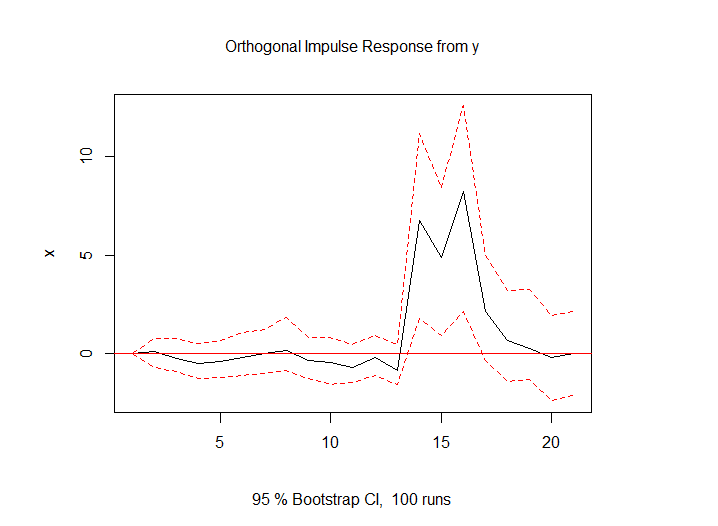
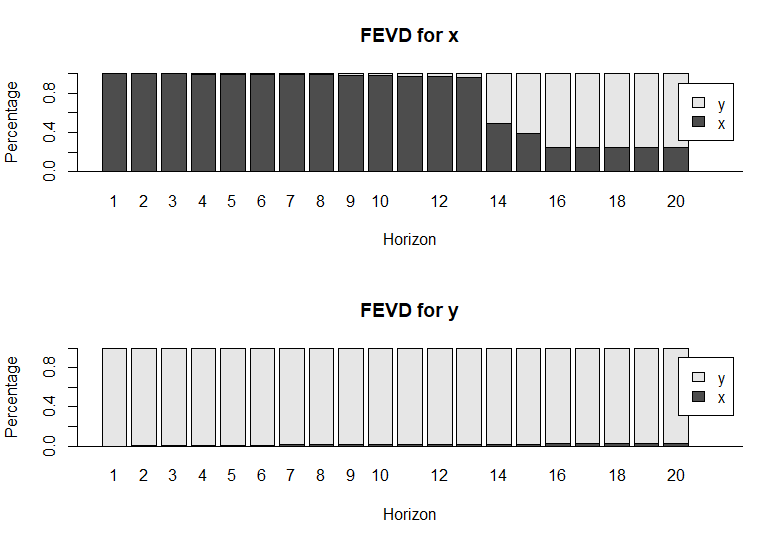

# 📁 Project: Suicide_Analyze

## 🧠 프로젝트 개요 | Project Overview

이 프로젝트는 “자살은 개인의 나약함”이라는 일각의 주장에 문제를 제기하며, 청년 자살률을 종속 변수로, 청년 실업률, 가계부채, 근로시간 등의 사회경제적 요인을 독립 변수로 설정한 다중회귀분석 모델을 구축하였습니다. 모든 변수는 Z-score 표준화를 거쳤으며, 이를 통해 자살이 개인의 문제가 아닌 사회 구조적 문제임을 통계적으로 입증하고자 하였습니다.

> This project challenges the narrative that suicide stems from personal weakness. Using a multiple regression model with youth suicide rates as the dependent variable and socio-economic factors such as youth unemployment, household debt, and working hours as independent variables (all standardized by Z-scores), it reveals suicide as a structural social issue.

또한, 자살과 같은 극단적 사회 현상이 사회 전체에 미치는 영향을 확인하기 위해 ‘자살’과 ‘칼부림’이라는 키워드를 중심으로 **구글 트렌드 데이터 시각화**, 단위근 검정(ADF) 및 그레인저 인과성 검정(Granger Test)을 통해 사회 감정의 전염 가능성을 분석했습니다.

> Furthermore, using Google Trends data for "suicide" and "stabbing", the project visualizes trends, preprocesses 5 years of data (as of June 2025), and performs ADF and Granger causality tests to explore how extreme social phenomena might influence or "infect" public sentiment.

---

## 📂 폴더 구조 | Folder Structure

- `CSV/`  
  - ‘자살’과 ‘칼부림’이라는 두 키워드를 구글 트렌드에 입력하여 수집한 최근 5년치(2020~2025)의 트렌드 데이터를 CSV로 저장  
  - _CSV files containing 5-year Google Trends data (2020–2025) for the keywords "suicide" and "stabbing"_

- `R_Code/`  
  - 종속 변수(청년 자살률)와 독립 변수(청년 실업률, 가계부채, 근로시간)를 구분하고 Z-score 표준화를 거쳐 다중 회귀 분석 모형을 제작하였으며, 선형성 시각화 작업을 포함함. 또한 구글 트렌드 CSV 파일을 불러와 VAR 분석 및 FEVD(분산 분해) 분석을 수행함.  
  - _R scripts that standardize variables (Z-scores), build a multiple linear regression model with youth suicide as the dependent variable, visualize linearity, and perform VAR and FEVD analysis using processed Google Trends CSV data._

- `Report_Kinda_Essay/`  
  - 분석을 시작하게 된 계기와 문제의식, 데이터 설명 및 코드 실행 화면(스크린샷 포함)을 담은 .docx 형식의 보고서  
  - _A .docx report that includes the motivation behind the analysis, contextual background, data overview, and code execution screenshots._
---

## 프로젝트 결과 | Project Results

### 📈 청년 실업률과 자살률 간 통계적 관계

다음 그래프는 청년 실업률과 자살률의 표준화된 값(Z-score) 간 회귀 분석 결과를 보여줍니다.  
통계적으로 유의미한 음의 상관관계가 확인되었으며, 이는 청년 자살의 사회 구조적 요인을 지지하는 결과입니다.

### 🧪 칼부림 이슈가 자살 관심도에 미치는 시차적 영향 분석

Granger 인과성 검정 결과, 칼부림 관련 검색량(y)은 자살 관련 검색량(x)을 통계적으로 유의미하게 예측하는 것으로 나타났습니다.  
이를 시간 흐름에 따라 시각화한 IRF(Impulse Response Function) 결과는 다음과 같습니다.

칼부림 검색량이 증가한 후 약 13일부터 자살 검색량이 증가하며,  
16일경 피크, 약 19일간 지속되는 영향력이 확인되었습니다.

### 📊 예측 오차 분산 분해 (FEVD)

Impulse Response Function(IRF)의 결과를 정량적으로 검증하기 위해, Forecast Error Variance Decomposition(FEVD)을 수행했습니다.  
이는 자살 검색량(x) 변화의 얼마만큼이 칼부림 검색량(y)이라는 외생변수에 의해 설명되는지를 시차별로 보여줍니다.

- 14일 차에 약 50%,  
- 16일 차부터는 약 75%에 육박하는 설명력**을 가지는 것으로 나타났습니다.

이는 IRF 결과가 단순 노이즈가 아니라 시계열적 인과 구조의 일부임을 강하게 지지합니다.

✅ 마지막 수정일: 2025년 6월 4일  
✍️ 작성자: jamjamdonkey
